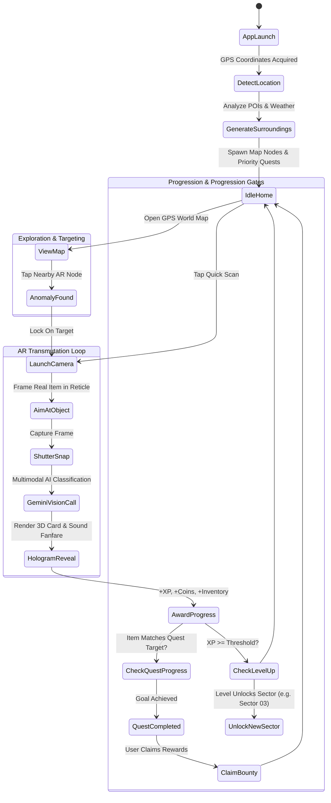

# Reality Quest AI — Technical Architecture & Database Design

## 1. System Architecture Overview

```mermaid
graph TD
    subgraph Client ["Client Layer (Mobile & Web)"]
        A[React Native / Expo Mobile App] --> B[Camera Module (expo-camera)]
        A --> C[Geolocation (expo-location)]
        A --> D[AR HUD Viewfinder & Reticle]
        A --> E[Zustand Game State Store]
    end

    subgraph Backend ["Backend & Cloud Layer (Firebase)"]
        F[Firebase Authentication]
        G[Cloud Firestore (Real-time NoSQL)]
        H[Cloud Storage (Scanned Images)]
        I[Cloud Functions (AI Gateway & Anti-Cheat)]
    end

    subgraph AI ["AI & Mapping Services"]
        J[Google Gemini 1.5 Flash Vision API]
        K[Google Maps Platform / Leaflet Carto]
        L[Weather API (Open-Meteo)]
    end

    B -->|Base64 Frame| I
    C -->|Coordinates| I
    I -->|Multimodal Prompt| J
    J -->|Structured JSON Asset| I
    I -->|Save Transmuted Asset| G
    I -->|Fetch POIs| K
    I -->|Weather Modifier| L
    G -->|Sync Player State| E
```

---

## 2. Complete Game Flow & State Machine



---

## 3. Database Structure (Firebase Cloud Firestore)

### Collection Schemas

#### 1. `users/{uid}`
```json
{
  "uid": "usr_99a8b7c6",
  "displayName": "Agent Echo",
  "avatar": "cyber_scout",
  "level": 3,
  "xp": 450,
  "xpToNext": 1000,
  "coins": 820,
  "diamonds": 45,
  "energy": 85,
  "maxEnergy": 100,
  "title": "Cyber Wayfinder",
  "streakDays": 4,
  "totalScans": 12,
  "questsCompleted": 7,
  "stats": {
    "perception": 74,
    "intellect": 68,
    "vitality": 82,
    "resonance": 65
  },
  "currentLocation": {
    "geopoint": [37.7749, -122.4194],
    "sectorId": "genesis_block",
    "updatedAt": "2026-09-09T10:30:00Z"
  },
  "createdAt": "2026-09-01T08:00:00Z",
  "lastActiveAt": "2026-09-09T10:35:00Z"
}
```

#### 2. `users/{uid}/inventory/{itemId}`
```json
{
  "id": "inv_tree_049",
  "name": "Magical Sylvan Wood",
  "originalObject": "Living Oak Tree",
  "category": "resource",
  "rarity": "rare",
  "icon": "🌲",
  "amount": 4,
  "description": "Ancient hardwood imbued with photosynthetic solar-mana.",
  "lore": "Synthesized from a living oak in the physical realm.",
  "stats": {
    "defense": "+18",
    "resonance": "+15"
  },
  "scanImageThumbnail": "https://storage.googleapis.com/.../thumb.jpg",
  "acquiredAt": "2026-09-09T09:15:00Z"
}
```

#### 3. `users/{uid}/quests/{questId}`
```json
{
  "id": "qst_bio_01",
  "title": "Bio-Synthesis Protocol",
  "targetObject": "Tree or Plant",
  "objective": "Scan 1 living tree or houseplant to extract Magical Wood.",
  "type": "scan",
  "currentProgress": 1,
  "requiredProgress": 1,
  "completed": true,
  "claimed": false,
  "rewardXP": 250,
  "rewardCoins": 150,
  "rewardItem": "Sylvan Seedling",
  "difficulty": "Normal",
  "region": "Sector 01: Genesis Block",
  "icon": "🌿",
  "expiresAt": "2026-09-10T00:00:00Z"
}
```

#### 4. `regions/{regionId}`
```json
{
  "id": "emerald_canopy",
  "name": "Sector 03: Emerald Canopy",
  "requiredLevel": 6,
  "description": "Overgrown botanical sanctum where nature spirits guard primordial elemental essences.",
  "ambientBonus": "+25% Mythic Potion potency",
  "themeColor": "#00ff9d",
  "boundaryGeoPolygon": [...]
}
```

#### 5. `scan_history/{scanId}`
```json
{
  "id": "scan_884920",
  "userId": "usr_99a8b7c6",
  "rawDetectedObject": "laptop",
  "confidence": 0.96,
  "transformedItemName": "Quantum Cyber Weapon",
  "rarity": "epic",
  "coordinates": [37.7749, -122.4194],
  "aiEngine": "gemini-1.5-flash",
  "timestamp": "2026-09-09T10:20:00Z"
}
```

---

## 4. Firebase Firestore Security Rules (`firestore.rules`)

```javascript
rules_version = '2';
service cloud.firestore {
  match /databases/{database}/documents {

    // Helper functions
    function isAuthenticated() {
      return request.auth != null;
    }
    
    function isOwner(userId) {
      return isAuthenticated() && request.auth.uid == userId;
    }

    // User profile documents
    match /users/{userId} {
      allow read: if isAuthenticated();
      allow write: if isOwner(userId);

      // Sub-collections: Inventory & Quests
      match /inventory/{itemId} {
        allow read, write: if isOwner(userId);
      }

      match /quests/{questId} {
        allow read, write: if isOwner(userId);
      }
    }

    // Public game definitions
    match /regions/{regionId} {
      allow read: if isAuthenticated();
      allow write: if false; // Admin only
    }

    // Scan logs
    match /scan_history/{scanId} {
      allow read: if isAuthenticated();
      allow create: if isAuthenticated() && request.resource.data.userId == request.auth.uid;
    }
  }
}
```

---

## 5. Multimodal AI Architecture (Gemini 1.5 Flash Vision)

### API Payload Schema

**HTTP Endpoint**:
`POST https://generativelanguage.googleapis.com/v1beta/models/gemini-1.5-flash:generateContent?key=${API_KEY}`

**System Prompt Formulation**:
```text
You are the AI Core of the game "Reality Quest AI".
Your mission: Analyze the camera image taken by the player, identify the physical object, and transmute it into an AR gaming asset.

Canonical conversion rules:
- Tree/Plant -> Magical Wood Resource
- Bottle/Cup -> Health Potion
- Chair/Desk -> Kinetic Shield/Armor
- Laptop/Phone/Screen -> Cyber Weapon
- Dog/Cat -> Loyal Familiar Companion
- Watch/Clock -> Chrono Relic
- Backpack -> Spatial Storage Bag

Return strictly a JSON response conforming to the JSON schema below.
```

**JSON Output Schema**:
```json
{
  "type": "object",
  "properties": {
    "detectedObject": { "type": "string" },
    "name": { "type": "string" },
    "category": { "type": "string", "enum": ["weapon", "equipment", "resource", "consumable", "companion", "artifact"] },
    "rarity": { "type": "string", "enum": ["common", "rare", "epic", "legendary", "mythic"] },
    "icon": { "type": "string" },
    "description": { "type": "string" },
    "lore": { "type": "string" },
    "stats": {
      "type": "object",
      "additionalProperties": { "type": "string" }
    },
    "xp": { "type": "integer" },
    "coins": { "type": "integer" }
  },
  "required": ["detectedObject", "name", "category", "rarity", "icon", "description", "lore", "stats", "xp", "coins"]
}
```
